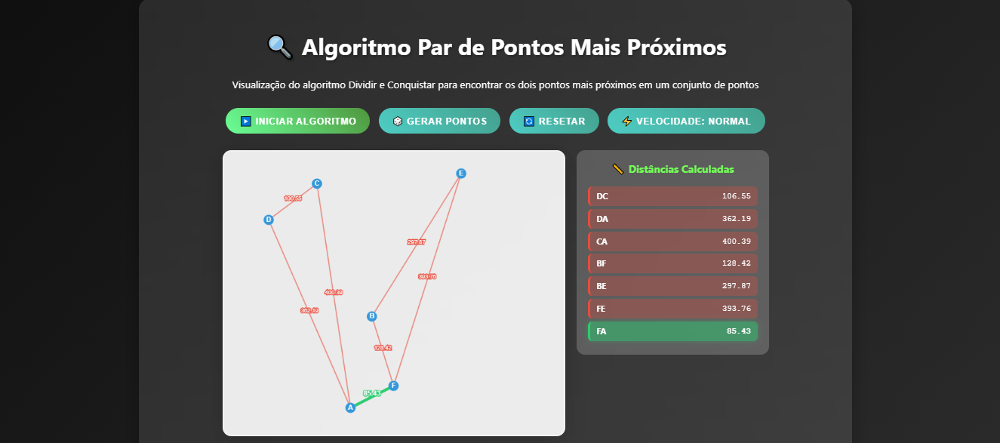
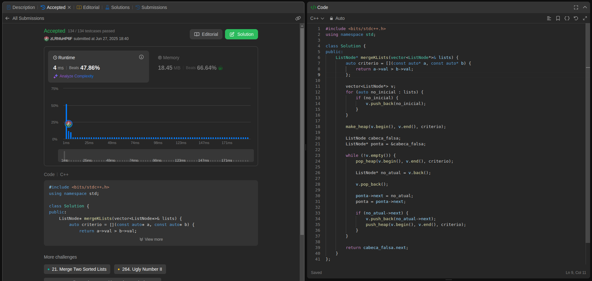
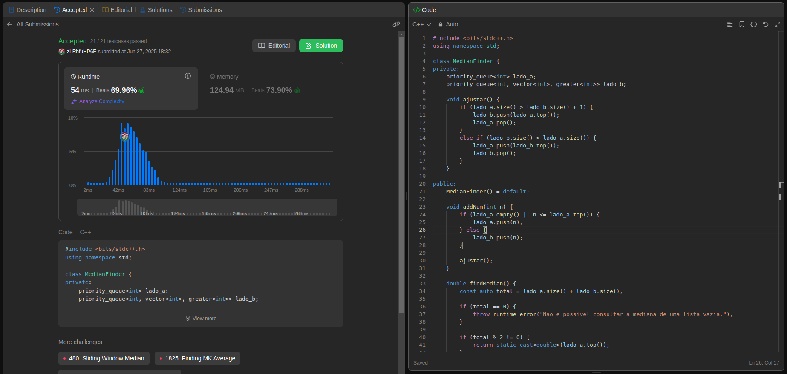
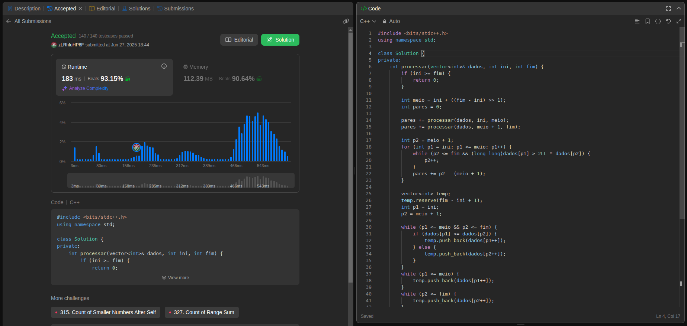

# DCLeetCode

# Aplicação Par de Pontos mais próximos + Exercícios LeetCode

- **Número da Lista**: 4 <br>
- **Conteúdo da Disciplina**: Dividir e Conquistar <br>
- [**Vídeo da Apresentação**](https://youtu.be/xQ6e-TBQOl0) <br>

## Alunos
|Matrícula | Aluno |GitHub|
| -- | -- | -- |
| 23/1035428  | Leonardo Henrique Sobral Sauma Junior |[leohssjr](https://github.com/leohssjr)|
| 23/1011426  | Gustavo Gontijo Lima |[Guga301104](https://github.com/guga301104)|

## Sobre 
Este repositório tem como objetivo a criação de uma aplicação que utiliza o algoritmo de dividir e conquistar para encontrar o par de pontos mais próximos, além da resolução de exercícios sobre divisão e conquista do [LeetCode](https://leetcode.com/), utilizando o conteúdo de Dividir e Conquistar da disciplina Projeto de Algoritmos, sendo 3 de nível difícil. Além disso o desenvolvimento de uma pequena aplicação utilizando um dos algoritmos estudados.


## Par de Pontos Mais Próximos - Aplicação
Certifique-se de ter o `make` e `python3` instalados 

```bash
git clone https://github.com/projeto-de-algoritmos-2025/DCLeetCode.git
make run
```

Após isso, a aplicação estará disponível em ```http://localhost:8000```



**Caso queira acessar diretamente pelo deploy, basta [clicar aqui](https://projeto-de-algoritmos-2025.github.io/DCLeetCode/).**


## Exercícios LeetCode

|Exercício | Dificuldade |
| -- | -- |
|[23](https://leetcode.com/problems/merge-k-sorted-lists/description/)|🔴 Difícil|
|[295](https://leetcode.com/problems/find-median-from-data-stream/description/)|🔴 Difícil|
|[493](https://leetcode.com/problems/reverse-pairs/description/)|🔴 Difícil|

## Screenshots

### Exercício 1 - [Merge k Sorted Lists](https://leetcode.com/problems/merge-k-sorted-lists/description/)


- Dificuldade: 🔴 Difícil <br>
- Problema: [23](https://leetcode.com/problems/merge-k-sorted-lists/description/) <br>
- [Resposta](questoes/leetcode_23.cpp) <br>

### Exerício 2 - [Find Median from Data Stream](https://leetcode.com/problems/find-median-from-data-stream/description/)


- Dificuldade: 🔴 Difícil <br>
- Problema: [295](https://leetcode.com/problems/find-median-from-data-stream/description/) <br>
- [Resposta](questoes/leetcode_295.cpp) <br>

### Exercício 3 - [Reverse Pairs](https://leetcode.com/problems/reverse-pairs/description/)


- Dificuldade: 🔴 Difícil <br>
- Problema: [493](https://leetcode.com/problems/reverse-pairs/description/) <br>
- [Resposta](questoes/leetcode_493.cpp) <br>

## Instalação 
**Linguagem**: C++
- Para os testes e julgamentos automáticos, os códigos devem ser executados no LeetCode.

## Uso 
Para cada código, deve-se:
- 1: Copiar o codigo do arquivo ```*.cpp``` disponível nesse repositório.
 
- 2: Entrar no site do LeetCode para o problema da questão.

- 5: Alterar a linguagem para ```C++``` caso esteja em outra linguagem.
 
- 6: Colar o código na área destinada para a resposta.
 
- 7: Clicar em ```Run``` para testar os casos básicos.

- 8: Clicar em ```Submit``` para receber o resultado de aprovação do código.
  
## Vídeo da Apresentação
Acesse o vídeo de explicação das resoluções [clicando aqui](https://youtu.be/xQ6e-TBQOl0).